```mermaid
sequenceDiagram
  participant DialogMb as DialogMb
  participant DispatchEditPyCellMb as DispatchEditPyCellMb
  participant DispatchWorker as DispatchWorker
  participant PySourceManager as PySourceManager
  participant PyModule as PyModule
  participant CodeRules as CodeRules
  participant CellCache as CellCache
  participant doc as CalcDoc
  participant sheet as CalcSheet
  participant cell as CalcCell
  participant CellMgr as CellMgr
  participant LplCell as LplCell
  participant PycRules as PycRules
  participant CtlMgr as CtlMgr
  participant pyc as PY.C
  participant shared_event as Macro Shared Event

  DispatchEditPyCellMb -> DispatchWorker: Show Dialog
  loop Every 0.1 Seconds
    DialogMb --> DispatchEditPyCellMb: Results
  end
  rect rgb(191, 123, 100)
    DialogMb -> pyc: Result OK
  end
  opt Invoke DispatchWorker
    opt Update Source
      DispatchWorker ->> PySourceManager: update_source()
      opt Reset Module
        PySourceManager ->> PyModule: reset_module()
      end
      PySourceManager ->> PyModule: _update_item()
      PyModule ->> PyModule: set_global_var()
      PyModule ->> PySourceManager: update_with_result()
      opt Code Rules
        PySourceManager ->> CodeRules: get_matched_rule()
      end
    end
    opt cell
      opt Update Code
        CellMgr ->> CellMgr: on_py_code_updated()
        CellMgr ->> CellMgr: _update_controls_forward()
        CellMgr ->> CellMgr: _update_py_event_control()
      end
      CellMgr ->> LplCell: update_control()
      LplCell ->> PySourceManager: __getitem()
      CellMgr ->> PycRules: get_matched_rule()
      opt _update_py_event_control()
        CellMgr ->> LplCell: _update_py_event_control()
        LplCell ->> CtlMgr: get_current_ctl_type_from_cell()
        LplCell ->> CtlMgr: get_orig_ctl_type_from_cell()
        CtlMgr ->> LplCell: update_ctl()
      end
      LplCell ->> CellMgr: update_control()
    end
    CellMgr --) DispatchWorker: Cell Code updated
    opt Update All
      DispatchWorker ->> PySourceManager: update_all()
      PySourceManager ->> PyModule: reset_module()
      PySourceManager ->> PySourceManager: __getitem()
      PySourceManager ->> PySourceManager: _update_item()
      PySourceManager ->> PyModule: set_global_var()
      PyModule ->> PySourceManager: update_with_result()
      PySourceManager ->> CodeRules: get_matched_rule()
      CodeRules ->> PySourceManager: get_matched_rule()
    end
    DispatchWorker ->> DialogMb: dispose()
    opt Cell Unsubscribe and subscribe
      CellMgr ->> DispatchWorker: Reset Formula
      DispatchWorker ->> pyc: py cell has code
      pyc ->> CellMgr: get_py_src()
      CellMgr ->> PySourceManager: __getitem()
      CellMgr --) pyc: get_py_src()
      DispatchWorker ->> PycRules: get_matched_rule()
      pyc ->> PycRules: get_matched_rule()
      pyc --) DispatchWorker: Done
      DispatchWorker ->> CellMgr: _on_calc_formulas_calculated()
      CellMgr ->> CellMgr: reset_py_inst()
      CellMgr ->> PySourceManager: update_all()
      PySourceManager ->> PyModule: reset_module()
      PySourceManager ->> PySourceManager: _update_item()
      PySourceManager ->> PyModule: set_global_var()
      PyModule ->> PySourceManager: update_with_result()
      PySourceManager ->> CodeRules: get_matched_rule()
      CodeRules --) PySourceManager: get_matched_rule()
      DispatchWorker ->> CellMgr: reset_py_inst()
      CellMgr --> DispatchWorker: _on_calc_formulas_calculated() Done
      CellMgr ->> shared_event: formulas_calc() Triggered CALC_FORMULAS_CALCULATED
    end
    DispatchEditPyCellMb --> DispatchEditPyCellMb: dispatch_in_thread() done.
    DispatchEditPyCellMb --> DispatchEditPyCellMb: thread_wrapper() done.

  end



```

Log Data

```
libre_pythonista: button_handler debug
libre_pythonista: button_handler: calc_doc: 2
libre_pythonista: button_handler: cell_obj: A1
    libre_pythonista: Init
    LplCell: Creating LplCell(A1)
        PySourceManager: __getitem() - Code Cell: (0, 0, 0)
        PySourceManager: __getitem() - Result Unique Id: id_jMnRngaLWzGsGb
    libre_pythonista: DispatchProviderInterceptor.queryDispatch: returning DispatchEditPyCellMb
DispatchEditPyCellMb: init: sheet=Sheet1, cell=A1
        DispatchEditPyCellMb: Thread with inst_id '2_0_A1' is running. Waiting for join.
    libre_pythonista: thread_wrapper inst_id: 2_0_A1
    libre_pythonista: dispatch_in_thread inst_id: 2_0_A1
    libre_pythonista: dispatch_in_thread creating DispatchWorker
DispatchWorker: init: inst_id=2_0_A1, cell=<ooodev.calc.calc_cell.CalcCell object at 0x73fd47eb2550>, url=.uno:libre_pythonista.calc.code.edit.mb
    libre_pythonista: dispatch_in_thread dispatching DispatchWorker
    DispatchWorker: dispatch: cell=A1
        PySourceManager: __getitem() - Code Cell: (0, 0, 0)
        PySourceManager: __getitem() - Result Unique Id: id_jMnRngaLWzGsGb
    DialogMb: Init
    DialogMb: Config Has Size
        DialogMb: _init_dialog() Config Has Position
    DialogMb: Init Complete
    DispatchWorker: Displaying dialog
        DialogMb: Window Opened
        DialogMb: Window Opened
        DialogMb: Window Activated
        DialogMb: Focus Gained
        DialogMb: Focus Lost
        DialogMb: Updating Window Config
            libre_pythonista.settings.settings: Settings. Configuration saved. Updating settings..
            libre_pythonista.settings.settings: Returning LibrePythonista settings.
        DialogMb: Config Updated
        DialogMb: Window Closed
        DialogMb: Window Closed
        DialogMb: Dialog Hidden
        DispatchWorker: Dialog returned with OK
        DispatchWorker: Code has changed, updating ...
            PySourceManager: update_source()
            PySourceManager: update_source() sheet index: 0 col: 0, row: 0
                PySourceManager: __getitem() - Code Cell: (0, 0, 0)
                PySourceManager: __getitem() - Result Unique Id: id_jMnRngaLWzGsGb
            PySourceManager: update_source() is last index updating from index 0
                PySourceManager: update_from_index(0) Entered.
                    PySourceManager: update_all() Entered.
                        PyModule: reset_module()
                        PyModule: reset_module() done.
                        PySourceManager: __getitem() - Code Cell: (0, 0, 0)
                        PySourceManager: __getitem() - Result Unique Id: id_jMnRngaLWzGsGb
                        PySourceManager: _update_item() Entered.
                        PySourceManager: _update_item() sheet index: 0 col: 0, row: 0
                            PyModule: set_global_var(CURRENT_CELL_ID, id_jMnRngaLWzGsGb)
                            PyModule: set_global_var(CURRENT_CELL_OBJ, A1)
                            PyModule: update_with_result()
                            libre_pythonista: CodeRules - get_matched_rule() found match rule: <RegexLastLine()>
                            libre_pythonista: CodeRules - get_matched_rule() Rule: <RegexLastLine()> is not LpFn or LpFnObj. Checking for LpFnValue match.
                                libre_pythonista: LpFnValue - get_is_match() Not a match. Returning False.
                            libre_pythonista: CodeRules - get_matched_rule() Found rule: <RegexLastLine()>
                        PySourceManager: _update_item() Leaving.
                    PySourceManager: update_all() Leaving.
                CellMgr: on_py_code_updated() Entering.
                    DialogMb: Window De-activated
                    CellMgr: _update_controls_forward() Updating controls for cells on and after: A1
                    CellMgr: Index: 0 Count: 1
                    CellMgr: Updating controls for 1 cells
                    CellMgr: Going to update control for cell: A1
                        CellMgr: _update_py_event_control() Updating control for cell: A1
                            LplCell: Creating LplCell(A1)
                            LplCell: ctl_state Setting state to 1
                            LplCell: ctl_state Current state is 1
                            LplCell: update_control() Entered
                                    PySourceManager: __getitem() - Code Cell: (0, 0, 0)
                                    PySourceManager: __getitem() - Result Unique Id: id_jMnRngaLWzGsGb
                            PycRules: get_matched_rule() cell: A1. Data Type DotDict
                            PycRules: get_matched_rule() Rule <RuleInt(A1, <ooodev.utils.helper.dot_dict.DotDict object at 0x73fd47eba050>)> matched.
                            LplCell: _update_py_event_control() Matched rule: cell_data_type_int
                                    libre_pythonista: CtlMgr - get_current_ctl_type_from_cell() Getting control type for cell A1
                                    libre_pythonista: CtlMgr - get_current_ctl_type_from_cell() Found control type for cell A1
                                    libre_pythonista: CtlMgr - get_orig_ctl_type_from_cell() Getting control type for cell A1
                                    libre_pythonista: CtlMgr - get_orig_ctl_type_from_cell() Found control type for cell A1
                                libre_pythonista: CtlMgr - update_ctl() Control type for cell A1 has not changed. Updating.
                                    libre_pythonista: FloatCtl: update_ctl(): Entered
                                    libre_pythonista: FloatCtl: update_ctl(): Found Shape: SHAPE_libre_pythonista_ctl_cell_id_jMnRngaLWzGsGb
                                    libre_pythonista: FloatCtl: update_ctl(): Leaving
                                libre_pythonista: CtlMgr - update_ctl() Done.
                            LplCell: update_control() Done
                        CellMgr: _update_py_event_control() Done.
                    CellMgr: _update_controls_forward() Done.
                CellMgr: on_py_code_updated() Done.
        DispatchWorker: Cell Code updated for A1
            PySourceManager: update_all() Entered.
                PyModule: reset_module()
                PyModule: reset_module() done.
                PySourceManager: __getitem() - Code Cell: (0, 0, 0)
                PySourceManager: __getitem() - Result Unique Id: id_jMnRngaLWzGsGb
                PySourceManager: _update_item() Entered.
                PySourceManager: _update_item() sheet index: 0 col: 0, row: 0
                    PyModule: set_global_var(CURRENT_CELL_ID, id_jMnRngaLWzGsGb)
                    PyModule: set_global_var(CURRENT_CELL_OBJ, A1)
                    PyModule: update_with_result()
                    libre_pythonista: CodeRules - get_matched_rule() found match rule: <RegexLastLine()>
                    libre_pythonista: CodeRules - get_matched_rule() Rule: <RegexLastLine()> is not LpFn or LpFnObj. Checking for LpFnValue match.
                        libre_pythonista: LpFnValue - get_is_match() Not a match. Returning False.
                    libre_pythonista: CodeRules - get_matched_rule() Found rule: <RegexLastLine()>
                PySourceManager: _update_item() Leaving.
            PySourceManager: update_all() Leaving.
        DispatchWorker: Code updated
        DialogMb: Dispose Called
            DialogMb: Disposing
    CellMgr: Listener context for cell: $Sheet1.$A$1
    CellMgr: Un-subscribing listeners for cell: $Sheet1.$A$1
    DispatchWorker: Resetting formula
    PyImpl: pyc entered
    PyImpl: pyc - Doc UID: 2
    PyImpl: pyc - sheet_num: arg 1
    PyImpl: pyc - cell_address: arg $A$1
    PyImpl: pyc - args count: 1
    PyImpl: pyc - Cell A1 for sheet index 0 has custom properties: True
    PyImpl: pyc - py cell has code
        CellMgr: get_py_src() Getting PySource for cell: A1
            PySourceManager: __getitem() - Code Cell: (0, 0, 0)
            PySourceManager: __getitem() - Result Unique Id: id_jMnRngaLWzGsGb
        CellMgr: get_py_src() Got PySource for cell: A1
    PycRules: get_matched_rule() cell: A1. Data Type DotDict
    PycRules: get_matched_rule() Rule <RuleInt(A1, <ooodev.utils.helper.dot_dict.DotDict object at 0x73fd2a105490>)> matched.
    PyImpl: pyc - Matched Rule: <RuleInt(A1, <ooodev.utils.helper.dot_dict.DotDict object at 0x73fd2a105490>)>
            libre_pythonista: FloatCtl: add_ctl(): Entered
            libre_pythonista: FloatCtl: add_ctl(): Found Shape: SHAPE_libre_pythonista_ctl_cell_id_jMnRngaLWzGsGb. Assuming control is in tact.
    PyImpl: pyc - Done
CellMgr: _on_calc_formulas_calculated() Entering.
    CellMgr: reset_py_inst() Resetting PyInstance
        PySourceManager: Init
    PyModule: _init_mod()
    PyModule: _init_mod() done.
        PySourceManager: update_all() Entered.
            PyModule: reset_module()
            PyModule: reset_module() done.
            PySourceManager: __getitem() - Code Cell: (0, 0, 0)
            PySourceManager: __getitem() - Result Unique Id: id_jMnRngaLWzGsGb
            PySourceManager: _update_item() Entered.
            PySourceManager: _update_item() sheet index: 0 col: 0, row: 0
                PyModule: set_global_var(CURRENT_CELL_ID, id_jMnRngaLWzGsGb)
                PyModule: set_global_var(CURRENT_CELL_OBJ, A1)
                PyModule: update_with_result()
                libre_pythonista: CodeRules - get_matched_rule() found match rule: <RegexLastLine()>
                libre_pythonista: CodeRules - get_matched_rule() Rule: <RegexLastLine()> is not LpFn or LpFnObj. Checking for LpFnValue match.
                    libre_pythonista: LpFnValue - get_is_match() Not a match. Returning False.
                libre_pythonista: CodeRules - get_matched_rule() Found rule: <RegexLastLine()>
            PySourceManager: _update_item() Leaving.
        PySourceManager: update_all() Leaving.
    CellMgr: reset_py_inst() Done
CellMgr: _on_calc_formulas_calculated() Done.
    libre_pythonista: formulas_calc() Triggered CALC_FORMULAS_CALCULATED event.
    CodeSheetModifyListener: Sheet Modified. Raising SHEET_MODIFIED event.
CellMgr: _on_sheet_modified() Entering.
CellMgr: _on_sheet_modified() Done.
    CodeCellListener: modified: Triggering event: cell_data_type_int
    CodeCellListener: modified: Triggering event: cell_data_type_int
    CodeCellListener: modified: Triggering event: cell_data_type_int
    PyImpl: pyc entered
    PyImpl: pyc - Doc UID: 2
    PyImpl: pyc - sheet_num: arg 1
    PyImpl: pyc - cell_address: arg $A$1
    PyImpl: pyc - args count: 1
    PyImpl: pyc - Cell A1 for sheet index 0 has custom properties: True
    PyImpl: pyc - py cell has code
        CellMgr: get_py_src() Getting PySource for cell: A1
            PySourceManager: __getitem() - Code Cell: (0, 0, 0)
            PySourceManager: __getitem() - Result Unique Id: id_jMnRngaLWzGsGb
        CellMgr: get_py_src() Got PySource for cell: A1
    PycRules: get_matched_rule() cell: A1. Data Type DotDict
    PycRules: get_matched_rule() Rule <RuleInt(A1, <ooodev.utils.helper.dot_dict.DotDict object at 0x73fd27d1e710>)> matched.
    PyImpl: pyc - Matched Rule: <RuleInt(A1, <ooodev.utils.helper.dot_dict.DotDict object at 0x73fd27d1e710>)>
            libre_pythonista: FloatCtl: add_ctl(): Entered
            libre_pythonista: FloatCtl: add_ctl(): Found Shape: SHAPE_libre_pythonista_ctl_cell_id_jMnRngaLWzGsGb. Assuming control is in tact.
    PyImpl: pyc - Done
CellMgr: _on_calc_formulas_calculated() Entering.
    CellMgr: reset_py_inst() Resetting PyInstance
        PySourceManager: Init
    PyModule: _init_mod()
    PyModule: _init_mod() done.
        PySourceManager: update_all() Entered.
            PyModule: reset_module()
            PyModule: reset_module() done.
            PySourceManager: __getitem() - Code Cell: (0, 0, 0)
            PySourceManager: __getitem() - Result Unique Id: id_jMnRngaLWzGsGb
            PySourceManager: _update_item() Entered.
            PySourceManager: _update_item() sheet index: 0 col: 0, row: 0
                PyModule: set_global_var(CURRENT_CELL_ID, id_jMnRngaLWzGsGb)
                PyModule: set_global_var(CURRENT_CELL_OBJ, A1)
                PyModule: update_with_result()
                libre_pythonista: CodeRules - get_matched_rule() found match rule: <RegexLastLine()>
                libre_pythonista: CodeRules - get_matched_rule() Rule: <RegexLastLine()> is not LpFn or LpFnObj. Checking for LpFnValue match.
                    libre_pythonista: LpFnValue - get_is_match() Not a match. Returning False.
                libre_pythonista: CodeRules - get_matched_rule() Found rule: <RegexLastLine()>
            PySourceManager: _update_item() Leaving.
        PySourceManager: update_all() Leaving.
    CellMgr: reset_py_inst() Done
CellMgr: _on_calc_formulas_calculated() Done.
    libre_pythonista: formulas_calc() Triggered CALC_FORMULAS_CALCULATED event.
    CodeSheetModifyListener: Sheet Modified. Raising SHEET_MODIFIED event.
CellMgr: _on_sheet_modified() Entering.
CellMgr: _on_sheet_modified() Done.
    CodeCellListener: modified: Triggering event: cell_data_type_int
    CodeCellListener: modified: Triggering event: cell_data_type_int
    CodeCellListener: modified: Triggering event: cell_data_type_int
    CellMgr: Subscribing to listeners for cell: $Sheet1.$A$1
    libre_pythonista: dispatch_in_thread done
    libre_pythonista: thread_wrapper finally inst_id: 2_0_A1
    DispatchEditPyCellMb: Thread with inst_id '2_0_A1' has joined.
DocumentEventListener: Document Event Occurred: OnCopyTo
DocumentEventListener: Document Event Occurred: OnCopyToDone

```