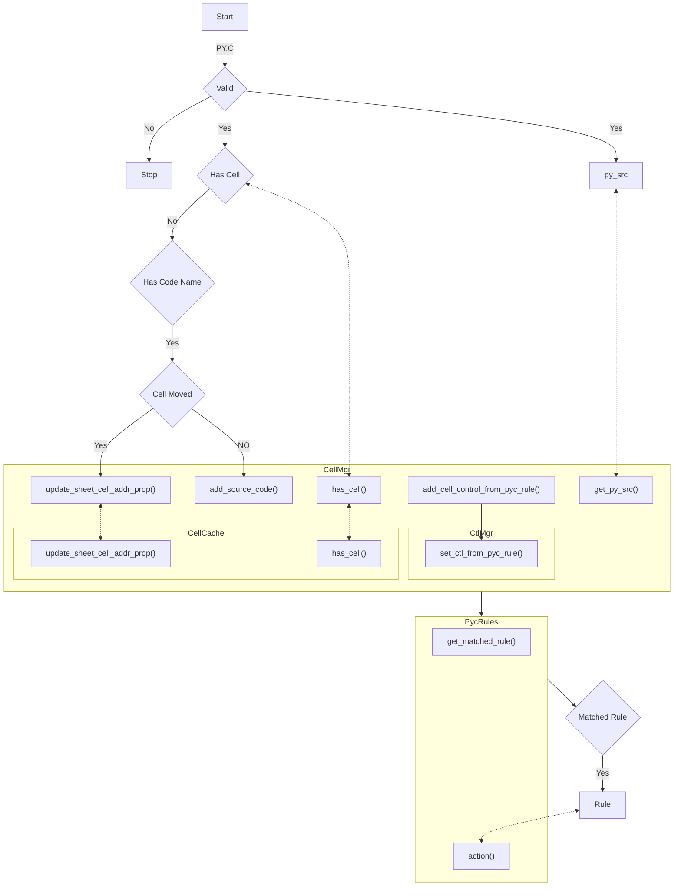

```mermaid
flowchart TB
 subgraph subgraph_8401cwmmc["CellCache"]
        node_b66z23j43["update_sheet_cell_addr_prop()"]
        nc["has_cell()"]
  end
 subgraph subgraph_m1qj884ak["CtlMgr"]
        node_0bf0imqki["set_ctl_from_pyc_rule()"]
  end
 subgraph subgraphName["CellMgr"]
        nodeId["update_sheet_cell_addr_prop()"]
        subgraph_8401cwmmc
        nm["add_source_code()"]
        nj["get_py_src()"]
        ns["add_cell_control_from_pyc_rule()"]
        subgraph_m1qj884ak
        n5["has_cell()"]
  end
 subgraph subgraph_awbkicztp["PycRules"]
        node_7tyj5nuv6["get_matched_rule()<br>"]
        ne["action()<br>"]
  end
    A["Start"] -- PY.C --> nh{"Valid"}
    nh -- No --> n2["Stop"]
    nh -- Yes --> no{"Has Cell"} & nl["py_src"]
    no -- No --> C{"Has Code Name"}
    C -- Yes --> nw{"Cell Moved"}
    nodeId <-.-> node_b66z23j43
    nw -- Yes --> nodeId
    nw -- NO --> nm
    subgraphName --> subgraph_awbkicztp
    subgraph_awbkicztp --> n9{"Matched Rule"}
    n9 -- Yes --> nk["Rule"]
    nk <-.-> ne
    ns --> node_0bf0imqki
    no <-.-> n5
    n5 <-.-> nc
    nl <-.-> nj


```